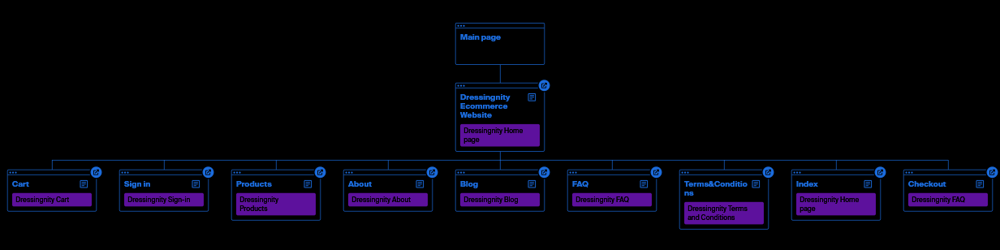

<!--suppress HtmlDeprecatedAttribute -->

<P align=center>
 
<h1 align=center> Dressingnity E-Commerce Website </h1>
</P>


<P align=center>This is for Our Dressingnity E-Commerce Site.</P>

See Repo: https://github.com/Prakash4844/Dressingnity-Ecommerce-Website

<h3>RUN Locally with Docker</h3>

<h4>Normal</h4>

run following commands in terminal:

Prerequisites: Docker must be installed in your system
```bash
$ docker pull prakash4844/dressingnity:latest
$ docker run -p 8080:8080 prakash4844/dressingnity:latest
```

open `localhost:8080` in browser and profit!!!

<h4>Manually</h4>

run following commands in terminal:

Prerequisites: Docker, git must be installed in your system
```bash
$ git clone https://github.com/Prakash4844/Dressingnity-Ecommerce-Website.git
$ cd Dressingnity-Ecommerce-Website'
$ docker build -t dressingnity:latest .
$ docker run -p 8080:8080 dressingnity:latest
```

open `localhost:8080` in browser and profit!!!


Checkout Static version here: [Dressingnity](https://prakash4844.github.io/Dressingnity-Ecommerce-Website/)
Static Site is built on HTML, CSS, Bootstrap, JS

Checkout Login Support with Database version here: [Dressingnity](https://dressingnity.rf.gd/)

This Version use all the technology of Static Site with PHP and SQLite for Backend.

<P align=center> 
    
</p>



<!-- Website Visitor -->
<P align=center> 
    
</p>


--- 

# Dockerfile explaination

This Dockerfile is used to build a Docker image for a lightweight container containing Nginx, PHP, and SQLite. It sets up an environment to host a web application. Let's break down the Dockerfile:

1. `FROM bravecheng/php-nginx-sqlite:latest`: This line sets the base image to "bravecheng/php-nginx-sqlite" with the "latest" tag. It's likely a pre-configured image containing PHP, Nginx, and SQLite for Alpine Linux.

2. `LABEL` statements: These lines provide metadata about the image, including author, maintainer, and description.

3. `WORKDIR /var/www/html`: This line sets the working directory within the container to "/var/www/html".

4. `USER nobody`: The subsequent commands are executed using the "nobody" user, switching from the root user for security reasons.

5. `COPY --chown=nobody . /var/www/html/`: This line copies the contents of the current directory into the container's "/var/www/html/" directory, ensuring the "nobody" user owns the copied files.

6. `EXPOSE 8080` and `EXPOSE 80`: These lines indicate that the container will expose ports 8080 and 80 to the host system.

7. `CMD ["/usr/bin/supervisord", "-c", "/etc/supervisor/conf.d/supervisord.conf"]`: This is the command that will be executed when the container starts. It launches the supervisord process with a specific configuration file, which likely manages the Nginx and PHP-FPM processes.

Complexity Level:
This Dockerfile is of moderate complexity. It includes multiple stages, labels, environment setup, user switching, copying files, exposing ports, and specifying the command to run. While not extremely complex, it covers various Dockerfile concepts and commands that a developer should understand to work with Docker effectively. It's suitable for intermediate users familiar with Docker basics and looking to build images with additional features like user switching and command customization.